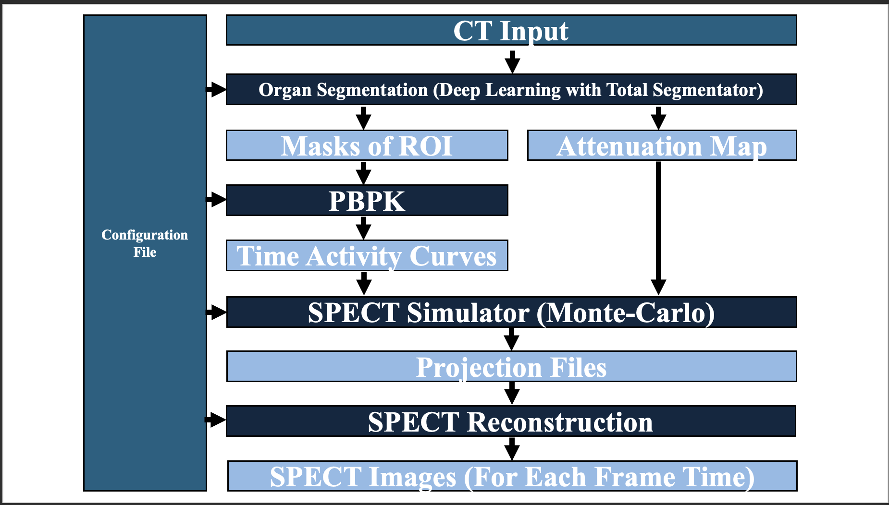

# Theranostic Digital Twins (TDT) Pipeline

> This pipeline creates patient-specific **theranostic digital twins** by combining CT-based anatomy/segmentation with PBPK kinetics and physics-based SPECT simulation/reconstruction, supporting research in diagnosis and therapy planning.

---

## Quick Start (minimal run)
1) Create + activate environment
```bash
conda env create -f environment.yml
conda activate TDT_env
```
2) Install PyCNO (PBPK dependency)
```bash
cd ~
git clone https://github.com/qurit/PyCNO.git
cd PyCNO
pip install -e .
```
3) Ensure SIMIND is installed and available
```bash
which simind
echo $SMC_DIR
```
4) Prepare inputs
```bash
mkdir -p inputs/ct_input
cp inputs/config_default.json inputs/config.json
```
5) Run
```bash
python -u main.py --config_file inputs/config.json --input_ct_dir inputs/ct_input
```
Outputs are written into a per-CT folder (see Outputs).

---

## Overview

**Theranostics** is a “diagnose and treat” approach that uses the same biological target to both detect disease and guide targeted therapy.

**Radiopharmaceuticals (RPTs)** couple a targeting molecule with a radionuclide that accumulates in tissues expressing a biomarker (e.g., tumors). As the radionuclide decays, emitted particles can deliver therapy while emitted photons enable quantitative imaging. For example, **¹⁷⁷Lu-PSMA** targets PSMA-expressing prostate cancer and supports post-therapy SPECT imaging.

The **Theranostic Digital Twins (TDT) Pipeline** is a quantitative software framework that uses real patient CT data to build end-to-end digital twins for theranostics research. It integrates:

- **Patient-specific anatomy** from clinical CT scans
- **Organ/tumor segmentation** (e.g., TotalSegmentator-based workflows)
- **Pharmacokinetic (PBPK) modeling** to generate time-activity behavior
- **Physics-based SPECT simulation + reconstruction** to produce quantitative images

Because uptake and dose can vary substantially between patients, TDTs support personalized evaluation of therapy strategies by enabling controlled, repeatable experiments across anatomy, kinetics, and imaging physics. A key objective is demonstrating agreement with patient measurements to support reliability and validation; longer-term, this work supports **Virtual Theranostic Trials (VTTs)** and patient-specific dosimetry prediction.



---

## Installation 
### Requirements
- Conda (Miniconda/Anaconda)
- A working C/C++ build toolchain for compiling certain Python dependencies (varies by OS)
- **PyCNO** installed separately (see Step 2)
- **SIMIND** installed separately (see Step 3)
#### Recommended
- Linux for full pipeline runs (SIMIND workflow tends to be simplest on Linux HPC/servers)
- Enough disk for intermediate SIMIND outputs (can be large depending on photons / frames / ROIs)

### 1) Create the conda environment (from `environment.yml`)
> Note: PyCNO is installed separately (Step 2). If `environment.yml` contains a `pycno` entry, remove it before creating the environment.
```bash
    conda env create -f environment.yml
    conda activate TDT_env
```
> This environment includes the required Python dependencies used by the pipeline (including TotalSegmentator and PyTomography).

### 2) PBPK dependency (PyCNO)
**PyCNO is required for the PBPK stage.**
Install PyCNO from source:
```bash
    cd ~
    git clone https://github.com/qurit/PyCNO.git
    cd PyCNO 
    pip install -e .
```

### 3) Install SIMIND (external)
**SIMIND is an external dependency** and must be installed separately (it is not a Python package).

#### Step 1 — Download and install SIMIND
Download SIMIND from the official site and follow their installation instructions:
```text
    https://www.msf.lu.se/en/research/simind-monte-carlo-program/downloads
```

#### Step 2 — Add SIMIND to your shell environment (recommended)
Add the following to your shell startup file so SIMIND is on your PATH and `SMC_DIR` is set.

For **zsh** or **bash**:
```bash
    nano ~/.zshrc
   # or
    nano ~/.bashrc
```

Paste (edit the path if your SIMIND install is elsewhere):
```bash
    # SIMIND setup
    SIM_DIR="$HOME/simind/simind"
    export SMC_DIR="$SIM_DIR/smc_dir/"
    export PATH="$SIM_DIR:$PATH"
```

Reload your shell:
```bash
    source ~/.zshrc
    # or
    source ~/.bashrc
```

(Optional sanity check)
```bash
which simind
echo $SMC_DIR
```

#### Step 3 — Point the pipeline config to SIMIND
In your JSON config, set the SIMIND directory to the folder that contains the `simind` executable:
- `spect_simulation.SIMINDDirectory` = directory that contains the `simind` executable

---

## Usage
> This repo is run via `main.py` using a user-editable JSON config and CT inputs placed under `inputs/`.  
> If you have not installed the required Python dependencies and external tools (e.g., SIMIND), please see **Installation** first.

1) **Create your run config**  
Copy the default config and create your own run config:
```bash
cp inputs/config_default.json inputs/config.json
```
Then edit `inputs/config.json`.

### Must update (most users)
- `spect_simulation.SIMINDDirectory` — path to your SIMIND install (must point to the `simind` executable).
- `spect_preprocessing.roi_subset` — list of ROIs 
- `pbpk.FrameStartTimes` and `pbpk.FrameDurations` — defines the time frames used throughout PBPK → simulation → reconstruction.

### Common tweaks (runtime / quality)
- `spect_preprocessing.xy_dim` — resizing used for SIMIND inputs (affects runtime/memory).
- `spect_simulation.NumPhotons`, `spect_simulation.NumProjections`, `spect_simulation.EnergyWindowWidth` — simulation fidelity vs. runtime.
- `spect_simulation.OutputImgSize`, `spect_simulation.OutputPixelWidth`, `spect_simulation.OutputSliceWidth` — output image size and voxel spacing.
- `spect_simulation.Iterations`, `spect_simulation.Subsets` — reconstruction settings.
- `spect_simulation.NumCores` — number of CPU cores for parallel SIMIND simulations (`0` = use all available cores).

### Mode behavior
- `mode` = `"DEBUG"` or `"PRODUCTION"`.
  - `DEBUG`: best for development/iteration.
  - `PRODUCTION`: intended for full runs; can skip re-running cases when final outputs already exist.

2) **CT Input**  
Place your CT data under the `inputs/` folder in a directory named `ct_input/`.

```bash
mkdir -p inputs/ct_input
```

You can put **any mix** of the following inside `inputs/ct_input/`:
- A **single NIfTI CT** file (`.nii` or `.nii.gz`)
- One or more **DICOM folders** (each folder containing a CT DICOM series)
- Multiple CTs (multiple NIfTIs and/or multiple DICOM folders)

3) **Command-line Interface**  
Required arguments
- --config_file : Path to your JSON config file.
- --input_ct_dir : Directory containing CT inputs (each item can be a DICOM folder or a .nii/.nii.gz).
Optional arguments
- --mode {DEBUG,PRODUCTION} : Controls verbosity and stage behavior (default: PRODUCTION).
- --logging_on / --no-logging_on : Enable/disable per-CT log file writing (default: enabled).
- --save_ct_scan / --no-save_ct_scan : Copy the CT input into the CT output folder for provenance/debugging (default: disabled).
- --save_config / --no-save_config : Copy the config JSON into each CT output folder (default: disabled).

4) **Run**  

**Basic Run (recommended)**
```bash
python -u main.py \
  --config_file inputs/config.json \
  --input_ct_dir inputs/ct_input \
```

**Run + All Options Set**
```bash
python -u main.py \
  --config_file inputs/config.json \
  --input_ct_dir inputs/ct_input \
  --mode PRODUCTION \
  --logging_on \
  --save_ct_scan \
  --save_config
```

---

## Outputs
Each CT input generates an output folder under output_folder.title with subfolders per stage.

### Example Structure

TDT_Output__CT_1/
  spect_preprocessing_outputs/
    (resampled CT, ROI labelmaps, masks, attenuation binaries, metadata)
  pbpk_outputs/
    (PBPK parameters, TACs, per-organ activity maps, summaries)
  spect_simulation_outputs/
    simind_work/
    spect_simulation_<roi>_tot_w1.a00
    spect_simulation_<roi>_tot_w2.a00
    spect_simulation_<roi>_tot_w3.a00
    spect_simulation_<t>min_tot_w1.a00
    spect_simulation_<t>min_tot_w2.a00
    spect_simulation_<t>min_tot_w3.a00
    calib.res
    spect_simulation_<t>min.nii
    spect_simulation_atn_img.nii
    
**Notes**:
- *_tot_w1/w2/w3.a00 are SIMIND energy-window projection totals (lower / photopeak / upper).
- calib.res is produced by SIMIND calibration and used to convert counts → activity.
- *_min.nii are reconstructed SPECT volumes.

---

## Contact
Maintainer: Peter Yazdi
Email: pyazdi@bccrc.ca


